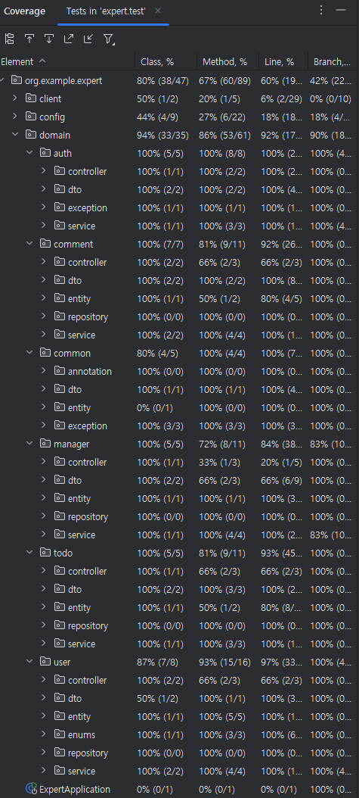

# SPRING ADVANCED

## 구현 내용
1. 코드 리팩토링
2. N+1 문제를 해결하는 fetch join->@EntityGraph 사용
3. 테스트 코드 연습
4. AOP를 사용한 사용자 권한 로깅
5. 추가적인 코드 구조 개선  
-> 개선 사항 정리: https://kny5579.tistory.com/81
6. 테스트 코드 작성

 

## 테스트 커버리지
